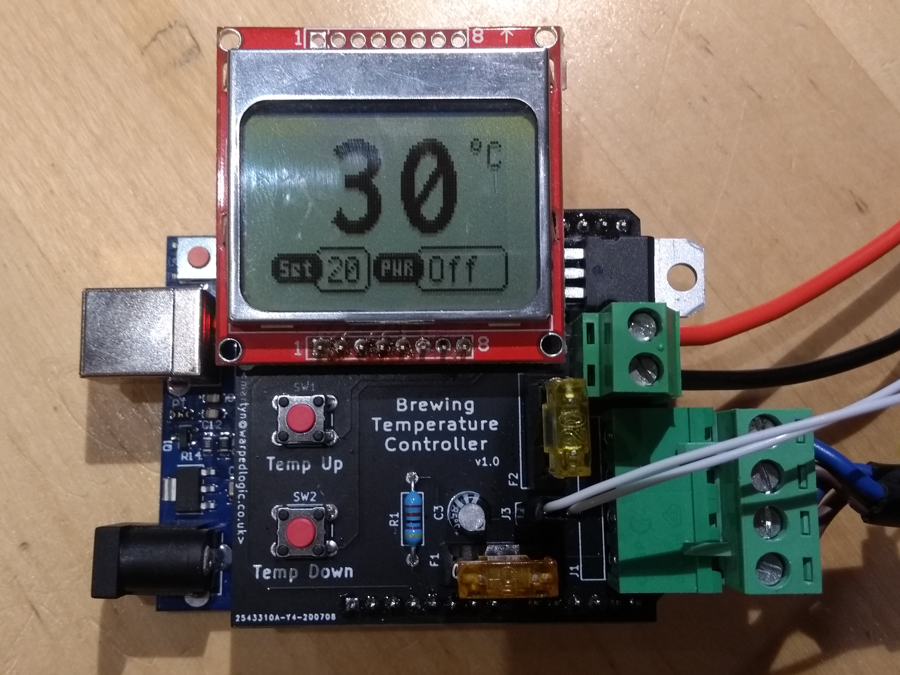

# Brew Temperature Controller



This project is a small heater controller that I have made to enable a few spare 3D printer parts I had lying arround to be used to control the temperature of my beer when brewing. I had been using a full RAMPS1.4 controller with a 4 line display, but this was very bulky. Rather than the Arduino Mega utilised with the RAMPS board, this uses an Arduino Uno, which is much smaller.

The device is fully powered from the PSU that's needed to supply power to the heater (this can not be pulled from the Arduino). If plugged in via USB, the set temperature, power output (scaled from 0-255) and current temperature are logged approximately once a second.

## PCB Ideas

- Improve layout of MOSFET now a more powerful transistor is being used.
- Getting noise back in (cheap) power supply, better smoothing?

## Code Ideas

- Better PID library

## Parts

- Parts below from CPC (cpc.farnell.com):

```
Order Code	Qty	Manufacturer Part Number	Manufacturer / Description									Line Price Ex. VAT (Inc. Vat)
SW02467		2	MCDTS6-1R			MULTICOMP PRO  Switch, Tactile 4.3mm 260g							0.22
CN21011		1	CTBP9358/4			CAMDENBOSS  5.08mm Horizontal Pluggable Terminal Block Header, 4-Pole, 15A			0.43
CN19453		1	CTB0708/2			CAMDENBOSS  PCB Terminal, High Power, 5.08mm, 2 Way						0.49
FF02092		2	MCCQ-122			MULTICOMP PRO  Fuseholder, PCB Mount, Mini Blade						0.48
CA08185		1	MCMR50V106M5X7			MULTICOMP PRO  Electrolytic Capacitor, 10 µF, 50 V, MCMR Series, ± 20%, Radial Leaded, 5 mm	0.05
SC11131		1	STP60NF06L			STMICROELECTRONICS  Power MOSFET, N Channel, 60 V, 60 A, 0.014 ohm, TO-220, Through Hole	1.36
```

- Nokia 5110 style screen with the following pinout:

```
Pin	Use
1	RST
2	CE
3	DC
4	DIN
5	CLK
6	VCC
7	LIGHT
8	GND
```

- Arduino Uno, cheap clone used
- Fuses: Standard Car mini Fuses. Used 5A (smallest I had) for electronics, 20A for heater output.
- Heater I found a standard 22cm circular 3D printer heated bed fits nicely under my brew bucket (it was this that inspired the build).
- Thermistor: Standard 100K thermistor, as used on many 3D printers.
- PSU: Currently using spare 0.8A 12v PSU as might be used on a small 3D printer.
